# BookSocial Studio

**[English](README.md) · [Italiano](README.it.md) · [Français](README.fr.md) · [Español](README.es.md) · [Deutsch](README.de.md)**


Transformez un livre (Markdown) en **contenu pour réseaux sociaux** prêt à être publié — des posts garantis sans spoilers, des reels et des stories avec du texte réel, des visuels générés par IA et de la musique — et planifiez/publiez-les sur Facebook et Instagram.

Il s'exécute **localement et auto-hébergé** : vos données restent sur votre machine dans une base de données SQLite embarquée. Les fournisseurs d'IA sont modulables (clé API ou CLI par abonnement) et l'interface utilisateur est multilingue (italien, anglais, français, espagnol, allemand).

## Captures d'écran

> L'interface est multilingue (italien, anglais, français, espagnol, allemand) ; les captures d'écran sont en anglais.

<table>
  <tr>
    <td width="50%" valign="top">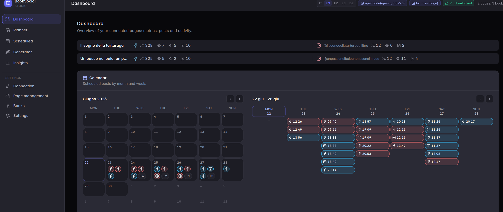<br/><sub><b>Tableau de bord — KPI, calendrier et statut des posts</b></sub></td>
    <td width="50%" valign="top">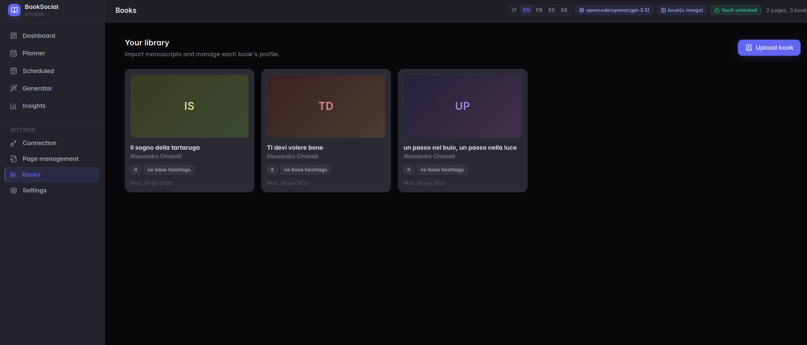<br/><sub><b>Bibliothèque — vos livres importés</b></sub></td>
  </tr>
  <tr>
    <td width="50%" valign="top">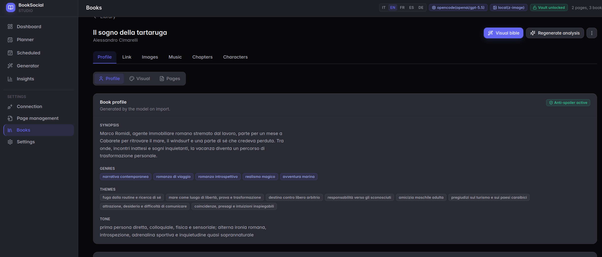<br/><sub><b>Profil du livre — analyse IA</b></sub></td>
    <td width="50%" valign="top">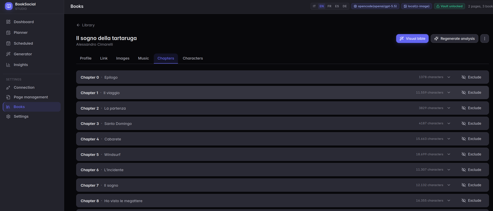<br/><sub><b>Chapitres et fiches de scène</b></sub></td>
  </tr>
  <tr>
    <td width="50%" valign="top">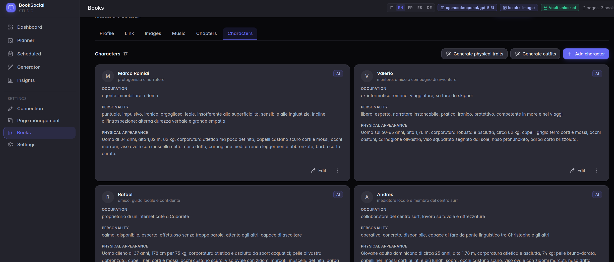<br/><sub><b>Personnages et bible visuelle</b></sub></td>
    <td width="50%" valign="top">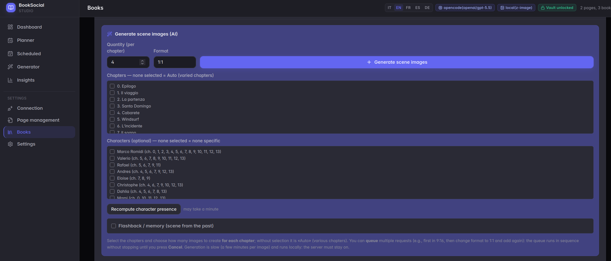<br/><sub><b>Images de scène IA</b></sub></td>
  </tr>
  <tr>
    <td width="50%" valign="top">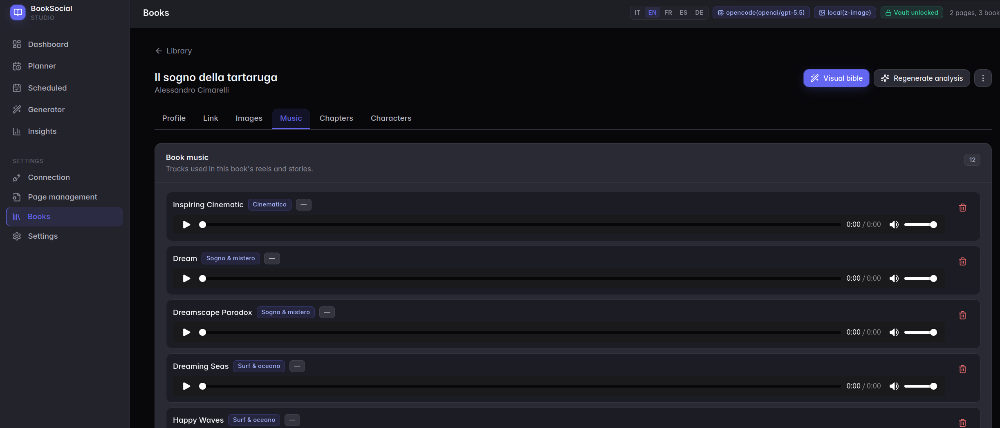<br/><sub><b>Bibliothèque musicale</b></sub></td>
    <td width="50%" valign="top">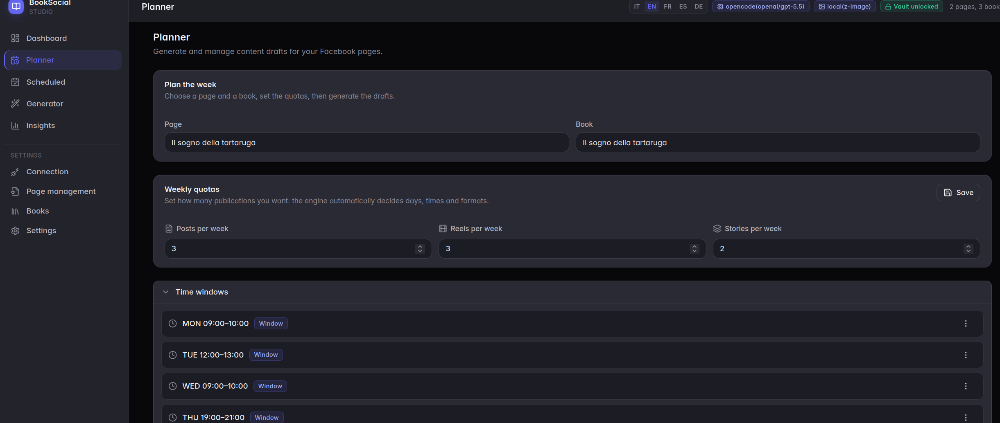<br/><sub><b>Planificateur hebdomadaire</b></sub></td>
  </tr>
  <tr>
    <td width="50%" valign="top">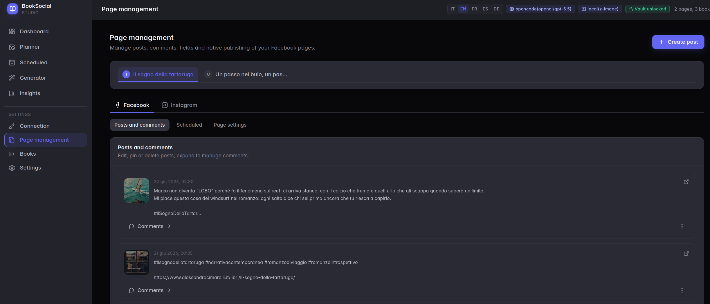<br/><sub><b>Gestion de page (Facebook/Instagram)</b></sub></td>
    <td width="50%" valign="top">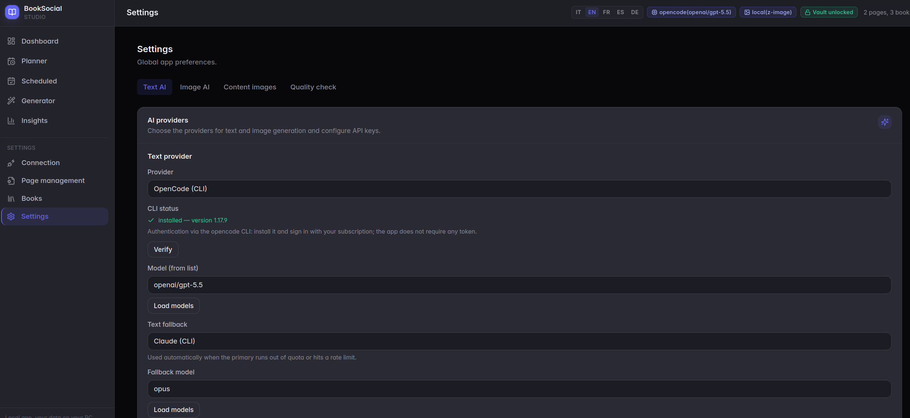<br/><sub><b>Paramètres — IA texte</b></sub></td>
  </tr>
  <tr>
    <td width="50%" valign="top">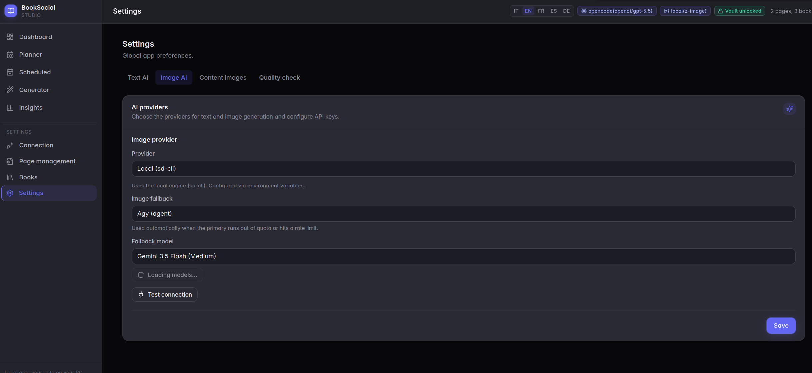<br/><sub><b>Paramètres — IA images</b></sub></td>
    <td width="50%" valign="top">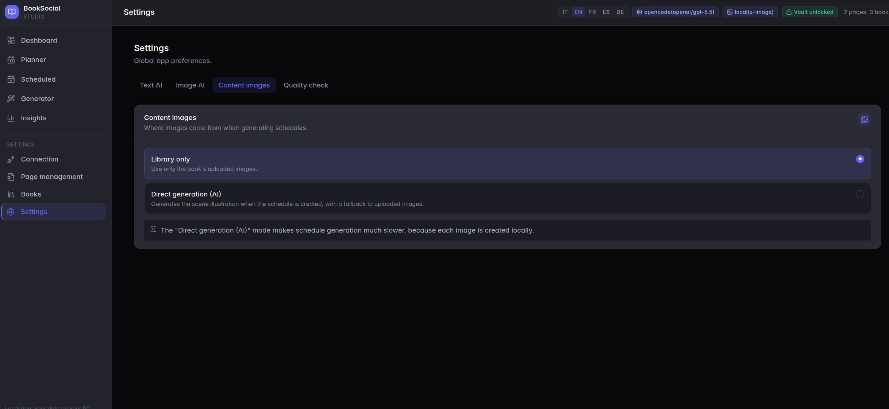<br/><sub><b>Paramètres — Images de contenu</b></sub></td>
  </tr>
  <tr>
    <td width="50%" valign="top">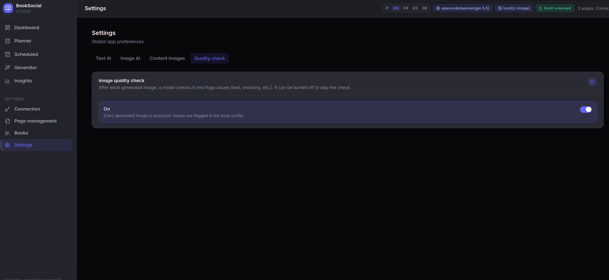<br/><sub><b>Paramètres — Contrôle qualité des images</b></sub></td>
  </tr>
</table>

## Documentation

- 📘 **[Manuel utilisateur](docs/MANUAL.md)** — guide opérationnel complet pour chaque écran (chargement de livre, planification, publication, paramètres).
- 🚀 **[Guide d'installation](docs/SETUP.md)** — installation, choix d'un fournisseur d'IA, connexion à Facebook (pour les non-développeurs).
- 🔌 **[Fournisseurs d'IA](docs/PROVIDERS.md)** — configuration et extension des moteurs de texte et d'images.
- 📸 **[Intégration Instagram](docs/INSTAGRAM.md)** — publier des Reels/Stories, onglets Facebook/Instagram, statistiques de compte.
- 🏗️ **[Architecture](docs/ARCHITECTURE.md)** — modules, flux import → publication, points d'extension.
- 🖥️ **[Testé sur notre matériel](docs/TESTED-ON.md)** — la machine/configuration exacte que nous avons utilisée et les performances en conditions réelles.
- 🤝 **[Contribution](CONTRIBUTING.md)** — configuration de développement, style de code, comment ajouter un fournisseur, PRs.

Le manuel utilisateur est également disponible en italien, espagnol, français, portugais et allemand
(`docs/MANUAL.it.md`, `.es.md`, `.fr.md`, `.pt.md`, `.de.md`). L'anglais est la version de référence.

**Essayez-le :** importez l'exemple inclus `samples/the-keeper-of-tides.md`.

## Fonctionnalités

- 📖 **Analyse de livre** : importer un livre `.md` → synopsis, genres, ton, personnages (garanti sans spoilers).
- 🎨 **Bible visuelle** par livre : apparence canonique des personnages, tenues selon le contexte, objets récurrents (avec côté conducteur), personnages mineurs et fiches de scène par chapitre — pour une imagerie cohérente.
- 🖼️ **Images de scène IA** (optionnel, GPU local) + une bibliothèque de téléchargement ; régénération par image et contrôle de qualité.
- ✍️ **Génération de contenu** vers un plan hebdomadaire : posts / reels / stories avec citations, hashtags et liens de vente.
  La logique "trouver l'idée, puis l'humaniser" est intégrée dans les prompts, cela fonctionne donc sur **n'importe quel** fournisseur.
- 📅 **Planification & publication** sur Facebook (planification native pour les posts ; planificateur interne pour les reels/stories).
- 📸 **Instagram** : publier des Reels/Stories vers des comptes Instagram Business associés, gérer les médias et les commentaires,
  et consulter les statistiques du compte. Voir [`docs/INSTAGRAM.md`](docs/INSTAGRAM.md).
- 🎬 Rendu vidéo de Reel/story (ffmpeg) avec musique, effet Ken‑Burns et fondus de texte.

## Stack

- **Backend** : Node + TypeScript + [Hono](https://hono.dev), **SQLite** embarqué (`better-sqlite3`).
- **Frontend** : React + Vite + Tailwind.
- **Média** : Satori/resvg (cartes textuelles), ffmpeg (vidéo). Génération d'images via une diffusion CLI locale (optionnel).

## Prérequis

- **Node.js 22 ou 24** (testé sur les deux en CI ; `.nvmrc` fixe la version 24). Les modules natifs (`better-sqlite3`) sont
  compilés pour votre version de Node — si vous changez de Node, exécutez `npm rebuild better-sqlite3`.
- Un **moteur de texte IA** — choisissez au choix : une **clé API** (OpenAI, Anthropic, Google, ou tout
  endpoint compatible OpenAI comme OpenRouter/Groq, plus **Ollama** en local), ou une **CLI par abonnement**
  à laquelle vous vous connectez avec un bouton **Authenticate** (`opencode`, Codex/ChatGPT, Gemini). Voir
  [`docs/PROVIDERS.md`](docs/PROVIDERS.md).
- Une **application Business Meta (Facebook) + Page** pour publier : vous collez un **System User token** dans
  l'écran de Connexion (conservé chiffré dans `secrets.enc`). Voir [`docs/SETUP.md`](docs/SETUP.md).
- *Optionnel* : un **moteur d'images** pour les images de scène IA — `sd-cli` local (GPU), ou un fournisseur cloud
  (OpenAI, Google Imagen, Stability, Black Forest Labs/FLUX, Replicate, fal.ai). Sans cela, l'application
  fonctionne en mode **upload-only** (vous fournissez les images). Voir [`docs/PROVIDERS.md`](docs/PROVIDERS.md).

## Démarrage rapide (Docker)

```bash
git clone https://github.com/Luporosso76/booksocial-studio.git
cd booksocial-studio
cp server/.env.example server/.env   # edit as needed
docker compose up -d --build
# → http://localhost:8771   (data persists in ./data)
```

> La génération d'images (GPU local) n'est **pas** disponible dans le conteneur — Docker fonctionne en mode upload-only.

## Démarrage rapide (manuel / développement)

```bash
# backend
cd server && npm ci && npm run dev      # tsx watch on :8770

# frontend (separate terminal)
cd web && npm ci && npm run dev         # Vite dev server, proxied to the API
```

Production (processus unique servant le frontend compilé) :

```bash
cd web && npm ci && npm run build       # outputs web/dist
cd ../server && npm ci && npm start     # serves API + ../web/dist on :8770
```

## Note de sécurité pour les serveurs distants

BookSocial Studio est conçu comme une application **local-first, mono-utilisateur** et se lie à `127.0.0.1` par
défaut. Le Docker Compose inclus définit `HOST=0.0.0.0` et mappe un port pour plus de commodité — si vous l'exécutez
sur un VPS ou l'exposez en dehors de localhost, **activez `AUTH_USER` et `AUTH_PASS`** et placez-le derrière un
reverse proxy avec HTTPS. N'exposez pas l'application publiquement sans authentification : elle peut accéder aux
données de projet locales, aux clés des fournisseurs d'IA et aux tokens de publication sociale.

## Configuration

Toute la configuration se fait via des variables d'environnement — voir [`server/.env.example`](server/.env.example). Points clés :

| Variable | Objectif | Par défaut |
|---|---|---|
| `PORT` / `HOST` | Liaison de l'API/serveur | `8770` / `127.0.0.1` |
| `BOOKSOCIAL_DATA_DIR` | Dossier de données (DB + médias + musique + livres) | `./data` (dans le projet) |
| `CONTENT_PROVIDER` | Moteur de texte IA (ou `none`, puis configurez dans les Settings) | `none` |
| `FB_API_VERSION` | Version de l'API Meta Graph | `v21.0` |

> **Où se trouve le dossier de données ?** Par défaut, il se trouve dans `./data` à l'intérieur du dossier du projet (il est
> ignoré par git, il n'est donc jamais commité) — un seul endroit pour la DB, les médias, la musique et les livres. Définissez
> `BOOKSOCIAL_DATA_DIR` pour le placer n'importe où ailleurs (un chemin absolu est recommandé pour la production). La configuration
> Docker incluse utilise `BOOKSOCIAL_DATA_DIR=/data` mappé sur `./data`, ce qui correspond donc au comportement par défaut.

Choisissez votre fournisseur de texte et votre modèle dans **Settings → AI**, ou définissez-les via les variables d'environnement
`*_MODEL` correspondantes — voir [`server/.env.example`](server/.env.example) et [`docs/PROVIDERS.md`](docs/PROVIDERS.md).

## Données & stockage

Tout se trouve sous le **répertoire de données** (`BOOKSOCIAL_DATA_DIR`), indépendamment de l'endroit où l'application est installée :

```
<data>/booksocial.sqlite   # the database (SQLite)
<data>/books/              # imported .md books
<data>/media/              # uploaded & generated images/video
<data>/music/              # per-book music tracks
```

Sauvegarder = copier le dossier de données. Déplacer l'application = déplacer le dossier. Les **Secrets** (tokens Facebook, clés API IA)
sont stockés **chiffrés** ici dans `secrets.enc` ; les identifiants de CLI par abonnement résident dans la CLI.

## Limites

- **La génération d'images** s'exécute localement sur un GPU par défaut (`sd-cli`) ; des backends cloud (OpenAI, Google Imagen, Stability, Black Forest Labs/FLUX, Replicate, fal.ai) sont disponibles, et sans aucun d'entre eux, l'application passe en mode **upload-only**. La génération locale est lente sans GPU dédié — voir [`docs/TESTED-ON.md`](docs/TESTED-ON.md).
- **Mono-utilisateur, local-first** (pas de multi-tenant). Authentification HTTP Basic optionnelle via `AUTH_USER`/`AUTH_PASS` ; se lie à `127.0.0.1` par défaut.
- Les clés des fournisseurs d'IA et la connexion Meta sont configurées dans **Settings** (conservées chiffrées dans `secrets.enc`) ou via `.env`.
- Aucune musique n'est incluse — apportez vos propres audios libres de droits pour les reels et les stories.

## Avertissement

Vous êtes responsable des livres que vous importez (utilisez du contenu que vous possédez ou avez le droit d'utiliser) et du respect des Conditions de la Plateforme Meta et des politiques de publication automatisée. Ce projet est fourni tel quel.

## Licence

**PolyForm Noncommercial License 1.0.0** — gratuit à utiliser, modifier, exécuter et partager à toute fin **non commerciale** (personnelle, recherche, éducation, organisations à but non lucratif, institutions publiques). **L'utilisation commerciale n'est pas autorisée.** Voir [`LICENSE`](LICENSE).

Il s'agit d'une licence *source-available*, et non d'une licence "open source" de l'OSI (les licences open source ne peuvent pas restreindre l'utilisation commerciale). Pour obtenir une licence commerciale, contactez l'auteur.

---

*`server/nlp/` est une pré-passe NLP Python optionnelle (exécutez `server/nlp/setup.sh` pour créer son venv).*
