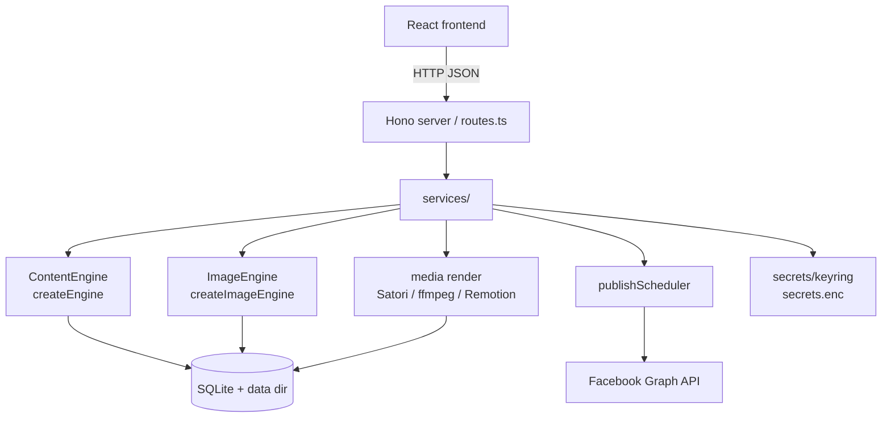

# Architektur

Eine High-Level-Übersicht, wie BookSocial Studio ein Markdown-Buch in geplante, veröffentlichte Social-Media-Inhalte verwandelt. Die App ist **local-first**: Ein einzelner Node-Prozess stellt die API und das gebaute Frontend bereit, wobei der gesamte Zustand in einer eingebetteten SQLite-Datenbank und als Dateien auf der Festplatte gespeichert wird.

---

## Gesamtbild

```
                ┌───────────────────────────────────────────────────────┐
                │                React + Vite + Tailwind (web/)           │
                │  Books · Planner · Insights · Connection · Settings     │
                └───────────────────────────┬───────────────────────────┘
                                             │ HTTP (JSON)
                ┌───────────────────────────▼───────────────────────────┐
                │              Hono server (server/src)                  │
                │  routes.ts → services/ → engines, db, scheduler        │
                └──┬───────────────┬───────────────┬──────────────┬─────┘
                   │               │               │              │
        ┌──────────▼───┐  ┌────────▼────────┐ ┌────▼──────┐ ┌─────▼──────────┐
        │ Content      │  │ Image engine    │ │ Media /   │ │ Scheduler /    │
        │ engine       │  │ (pluggable)     │ │ render    │ │ publisher      │
        │ (pluggable)  │  │ createImage     │ │ Satori,   │ │ publish        │
        │ createEngine │  │ Engine()        │ │ resvg,    │ │ Scheduler.ts   │
        └──────┬───────┘  └────────┬────────┘ │ ffmpeg,   │ └───────┬────────┘
               │                   │          │ Remotion  │         │
               │                   │          └─────┬─────┘         │
        ┌──────▼───────────────────▼────────────────▼───────────────▼──────┐
        │   SQLite (better-sqlite3) · data dir: media/ music/ books/        │
        │   db/migrate · db/repositories · secrets/keyring → secrets.enc    │
        └───────────────────────────────────────────────────────────────────┘
                                             │
                                             ▼
                                  Facebook Graph API (facebook/client.ts)
```

---

## Backend-Module (`server/src`)

| Modul | Verantwortung |
|---|---|
| `routes.ts` | HTTP API-Oberfläche (Hono); delegiert an Services. |
| `content/` | **Text-Engine.** `analyzer`, `characterAppearance`, `chapterScene`, `postGenerator`, `translate`, usw. Die steckbare `ContentEngine` befindet sich in `content/engine.ts`; HTTP-Implementierungen in `content/engineApi.ts`. |
| `media/` | **Image-Engine** (`imageEngine.ts`, `imageGen.ts`) und **Rendering**: Textkarten via Satori/resvg (`renderCard.ts`), Video-Reels/Stories via ffmpeg und Remotion (`renderVideo.ts`, `renderRemotion.ts`, `renderQueue.ts`). |
| `services/` | Orchestrierung: `visualBible`, `weekPlanner`, `contentService`, `publisher`, `pageConnectService`. |
| `scheduler/` | `publishScheduler.ts` — Hintergrundschleife, die fällige Elemente (Reels/Stories) veröffentlicht und bei Fehlern Wiederholungen durchführt. |
| `db/` | SQLite `migrate.ts`, Connection `pool.ts` und `repositories.ts` (Datenzugriff). |
| `secrets/` | `keyring.ts` — ver- und entschlüsselt Tokens und API-Keys in `secrets.enc`. |
| `facebook/` | `client.ts` — Facebook Graph API Aufrufe (verwaltete Pages auflisten, veröffentlichen, Page-Metadaten). |
| `config.ts` / `paths.ts` | Env-gesteuerte Konfiguration und Auflösung der Datenverzeichnisstruktur. |
| `*Jobs.ts` | Langlaufende Hintergrundjobs (Analysis, Visual Bible, Week Generation, Scene/Media Generation). |

---

## Der Hauptablauf

```
1. Import book        importer.ts          .md → stored in books/ + DB record
        │
2. Analysis           analyzer.ts          synopsis, genres, tone, characters (spoiler-aware)
        │             (analysisJobs.ts)
        │
3. Visual bible       services/visualBible  canonical character appearance, per-context outfits,
        │             characterAppearance,   recurring props, minor characters, per-chapter scene cards
        │             characterOutfits, …    → consistent imagery
        │
4. Week generation    services/weekPlanner   a weekly plan: posts / reels / stories with quotes,
        │             weekGenJobs.ts          hashtags, sale links (postGenerator.ts)
        │
5. Scene images       services/sceneImage     ImageEngine generates scene images (or upload-only);
        │             sceneGenJobs.ts          imagePrompt.ts builds styled prompts; visionCheck.ts QC
        │
6. Render             media/renderCard,       text cards (Satori/resvg) + reel/story videos
        │             renderVideo, renderQueue  (ffmpeg / Remotion: Ken-Burns, music, text fades)
        │
7. Publish / schedule services/publisher,     Facebook native scheduling for posts; internal
                      scheduler/publishScheduler  scheduler for reels/stories, with retries
```

Tokens und API-Keys, die auf dem Weg verwendet werden, werden über `secrets/keyring.ts` gelesen (ruhend verschlüsselt in `secrets.enc`) und niemals im Klartext gespeichert.

---

## Erweiterungspunkte

Das System ist so konzipiert, dass das Hinzufügen eines KI-Providers die aufrufenden Stellen **nicht** berührt. Es gibt genau zwei steckbare Engines, jeweils ein Interface plus ein zentrales Factory-`switch`:

### Text — `ContentEngine`

- Interface und Factory in `server/src/content/engine.ts`:
  - `interface ContentEngine { name(): string; run(prompt: string): Promise<string>; }`
  - `function createEngine(): ContentEngine` — routet basierend auf `CONTENT_PROVIDER`.
- HTTP-Implementierungen (OpenAI-kompatibel, Google Gemini, Anthropic) in `content/engineApi.ts`; Fehler werfen `ContentError`.

### Bilder — `ImageEngine`

- Interface und Factory in `server/src/media/imageEngine.ts`:
  - `interface ImageEngine { name(): string; available(): boolean; generate(input): Promise<string | null>; }`
  - `function createImageEngine(): ImageEngine` — routet basierend auf `IMAGE_PROVIDER`.
- Implementierungen: `OpenAIImageEngine`, `GoogleImagenImageEngine`, `LocalSdCliImageEngine`. Bei Fehlern oder Nichtverfügbarkeit geben sie `null` zurück, und die App fällt auf den reinen Upload-Modus zurück.

Um einen Provider hinzuzufügen: Implementiere das Interface, füge ein `case` in der passenden Factory hinzu, trage jegliche Konfiguration in `server/src/config.ts` ein und dokumentiere die Env-Vars in `server/.env.example`. Vollständige Anleitung: [`docs/PROVIDERS.md`](PROVIDERS.md) → "Add a new provider in code".

---

## Mermaid-Ansicht (optional)



Siehe auch [`docs/SETUP.md`](SETUP.md) und [`CONTRIBUTING.md`](../CONTRIBUTING.md).
