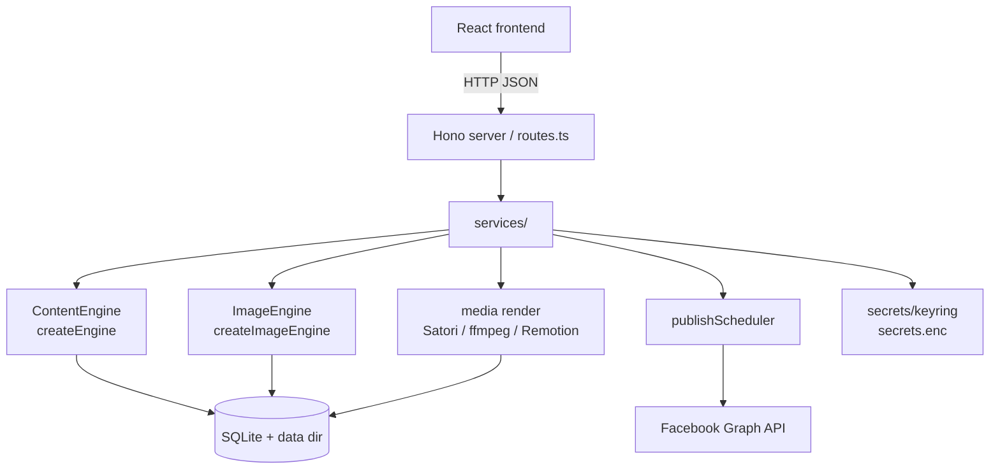

# Arquitectura

Un mapa de alto nivel de cómo BookSocial Studio convierte un libro en Markdown en contenido programado y publicado para redes sociales. La aplicación es **local-first**: un único proceso de Node sirve la API y el frontend compilado, con todo el estado en una base de datos SQLite integrada y archivos en disco.

---

## Visión general

```
                ┌───────────────────────────────────────────────────────┐
                │                React + Vite + Tailwind (web/)           │
                │  Books · Planner · Insights · Connection · Settings     │
                └───────────────────────────┬───────────────────────────┘
                                             │ HTTP (JSON)
                ┌───────────────────────────▼───────────────────────────┐
                │              Hono server (server/src)                  │
                │  routes.ts → services/ → engines, db, scheduler        │
                └──┬───────────────┬───────────────┬──────────────┬─────┘
                   │               │               │              │
        ┌──────────▼───┐  ┌────────▼────────┐ ┌────▼──────┐ ┌─────▼──────────┐
        │ Content      │  │ Image engine    │ │ Media /   │ │ Scheduler /    │
        │ engine       │  │ (pluggable)     │ │ render    │ │ publisher      │
        │ (pluggable)  │  │ createImage     │ │ Satori,   │ │ publish        │
        │ createEngine │  │ Engine()        │ │ resvg,    │ │ Scheduler.ts   │
        └──────┬───────┘  └────────┬────────┘ │ ffmpeg,   │ └───────┬────────┘
               │                   │          │ Remotion  │         │
               │                   │          └─────┬─────┘         │
        ┌──────▼───────────────────▼────────────────▼───────────────▼──────┐
        │   SQLite (better-sqlite3) · data dir: media/ music/ books/        │
        │   db/migrate · db/repositories · secrets/keyring → secrets.enc    │
        └───────────────────────────────────────────────────────────────────┘
                                             │
                                             ▼
                                  Facebook Graph API (facebook/client.ts)
```

---

## Módulos del backend (`server/src`)

| Módulo | Responsabilidad |
|---|---|
| `routes.ts` | Superficie de la HTTP API (Hono); delega a los `services`. |
| `content/` | **Motor de texto.** `analyzer`, `characterAppearance`, `chapterScene`, `postGenerator`, `translate`, etc. El `ContentEngine` conectable reside en `content/engine.ts`; las implementaciones HTTP en `content/engineApi.ts`. |
| `media/` | **Motor de imágenes** (`imageEngine.ts`, `imageGen.ts`) y **renderizado**: tarjetas de texto a través de Satori/resvg (`renderCard.ts`), reels/stories de video a través de ffmpeg y Remotion (`renderVideo.ts`, `renderRemotion.ts`, `renderQueue.ts`). |
| `services/` | Orquestación: `visualBible`, `weekPlanner`, `contentService`, `publisher`, `pageConnectService`. |
| `scheduler/` | `publishScheduler.ts` — bucle en segundo plano que publica los elementos pendientes (reels/stories) y reintenta en caso de fallos. |
| `db/` | `migrate.ts` de SQLite, conexión `pool.ts` y `repositories.ts` (acceso a datos). |
| `secrets/` | `keyring.ts` — cifra/descifra tokens y API keys en `secrets.enc`. |
| `facebook/` | `client.ts` — llamadas a la Facebook Graph API (listar Pages administradas, publicar, metadatos de páginas). |
| `config.ts` / `paths.ts` | Configuración basada en variables de entorno y resolución de la estructura del directorio de datos. |
| `*Jobs.ts` | Trabajos en segundo plano de larga duración (análisis, visual bible, generación semanal, generación de escenas/medios). |

---

## El flujo principal

```
1. Import book        importer.ts          .md → stored in books/ + DB record
        │
2. Analysis           analyzer.ts          synopsis, genres, tone, characters (spoiler-aware)
        │             (analysisJobs.ts)
        │
3. Visual bible       services/visualBible  canonical character appearance, per-context outfits,
        │             characterAppearance,   recurring props, minor characters, per-chapter scene cards
        │             characterOutfits, …    → consistent imagery
        │
4. Week generation    services/weekPlanner   a weekly plan: posts / reels / stories with quotes,
        │             weekGenJobs.ts          hashtags, sale links (postGenerator.ts)
        │
5. Scene images       services/sceneImage     ImageEngine generates scene images (or upload-only);
        │             sceneGenJobs.ts          imagePrompt.ts builds styled prompts; visionCheck.ts QC
        │
6. Render             media/renderCard,       text cards (Satori/resvg) + reel/story videos
        │             renderVideo, renderQueue  (ffmpeg / Remotion: Ken-Burns, music, text fades)
        │
7. Publish / schedule services/publisher,     Facebook native scheduling for posts; internal
                      scheduler/publishScheduler  scheduler for reels/stories, with retries
```

Los tokens y las API keys utilizados en el proceso se leen a través de `secrets/keyring.ts` (cifrados en reposo en `secrets.enc`), y nunca se almacenan en texto plano.

---

## Puntos de extensión

El sistema está diseñado para que añadir un proveedor de IA **no** afecte a quienes lo invocan. Existen exactamente dos motores conectables, cada uno compuesto por una interfaz y un `switch` de fábrica central:

### Texto — `ContentEngine`

- Interfaz y fábrica en `server/src/content/engine.ts`:
  - `interface ContentEngine { name(): string; run(prompt: string): Promise<string>; }`
  - `function createEngine(): ContentEngine` — enruta basándose en `CONTENT_PROVIDER`.
- Implementaciones HTTP (compatibles con OpenAI, Google Gemini, Anthropic) en `content/engineApi.ts`; los fallos lanzan `ContentError`.

### Imágenes — `ImageEngine`

- Interfaz y fábrica en `server/src/media/imageEngine.ts`:
  - `interface ImageEngine { name(): string; available(): boolean; generate(input): Promise<string | null>; }`
  - `function createImageEngine(): ImageEngine` — enruta basándose en `IMAGE_PROVIDER`.
- Implementaciones: `OpenAIImageEngine`, `GoogleImagenImageEngine`, `LocalSdCliImageEngine`. En caso de fallo o cuando no están disponibles devuelven `null`, y la aplicación vuelve al modo de solo subida (upload-only).

Para añadir un proveedor: implementa la interfaz, añade un `case` en la fábrica correspondiente, añade cualquier configuración en `server/src/config.ts`, y documenta las variables de entorno en `server/.env.example`. Guía completa: [`docs/PROVIDERS.md`](PROVIDERS.md) → "Add a new provider in code".

---

## Vista de Mermaid (opcional)



Consulta también [`docs/SETUP.md`](SETUP.md) y [`CONTRIBUTING.md`](../CONTRIBUTING.md).
