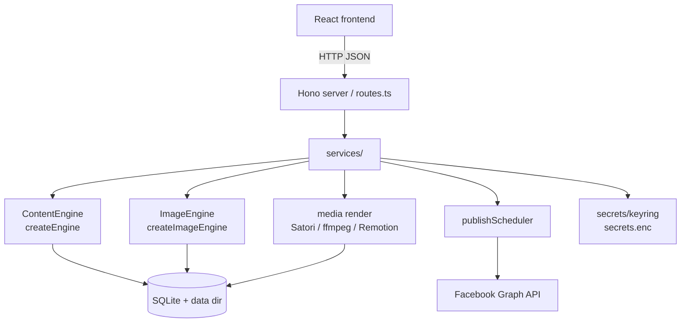

# Architecture

Une carte de haut niveau montrant comment BookSocial Studio transforme un livre Markdown en contenu de médias sociaux programmé et publié. L'application est **local-first** : un seul processus Node sert l'API et le frontend compilé, avec tout l'état dans une base de données SQLite intégrée et des fichiers sur le disque.

---

## Vue d'ensemble

```
                ┌───────────────────────────────────────────────────────┐
                │                React + Vite + Tailwind (web/)           │
                │  Books · Planner · Insights · Connection · Settings     │
                └───────────────────────────┬───────────────────────────┘
                                             │ HTTP (JSON)
                ┌───────────────────────────▼───────────────────────────┐
                │              Hono server (server/src)                  │
                │  routes.ts → services/ → engines, db, scheduler        │
                └──┬───────────────┬───────────────┬──────────────┬─────┘
                   │               │               │              │
        ┌──────────▼───┐  ┌────────▼────────┐ ┌────▼──────┐ ┌─────▼──────────┐
        │ Content      │  │ Image engine    │ │ Media /   │ │ Scheduler /    │
        │ engine       │  │ (pluggable)     │ │ render    │ │ publisher      │
        │ (pluggable)  │  │ createImage     │ │ Satori,   │ │ publish        │
        │ createEngine │  │ Engine()        │ │ resvg,    │ │ Scheduler.ts   │
        └──────┬───────┘  └────────┬────────┘ │ ffmpeg,   │ └───────┬────────┘
               │                   │          │ Remotion  │         │
               │                   │          └─────┬─────┘         │
        ┌──────▼───────────────────▼────────────────▼───────────────▼──────┐
        │   SQLite (better-sqlite3) · data dir: media/ music/ books/        │
        │   db/migrate · db/repositories · secrets/keyring → secrets.enc    │
        └───────────────────────────────────────────────────────────────────┘
                                             │
                                             ▼
                                  Facebook Graph API (facebook/client.ts)
```

---

## Modules backend (`server/src`)

| Module | Responsabilité |
|---|---|
| `routes.ts` | Surface de l'API HTTP (Hono) ; délègue aux services. |
| `content/` | **Moteur de texte.** `analyzer`, `characterAppearance`, `chapterScene`, `postGenerator`, `translate`, etc. Le `ContentEngine` enfichable se trouve dans `content/engine.ts` ; les implémentations HTTP dans `content/engineApi.ts`. |
| `media/` | **Moteur d'image** (`imageEngine.ts`, `imageGen.ts`) et **rendu** : cartes de texte via Satori/resvg (`renderCard.ts`), vidéos reels/stories via ffmpeg et Remotion (`renderVideo.ts`, `renderRemotion.ts`, `renderQueue.ts`). |
| `services/` | Orchestration : `visualBible`, `weekPlanner`, `contentService`, `publisher`, `pageConnectService`. |
| `scheduler/` | `publishScheduler.ts` — boucle en arrière-plan qui publie les éléments échus (reels/stories) et relance les échecs. |
| `db/` | SQLite `migrate.ts`, connexion `pool.ts`, et `repositories.ts` (accès aux données). |
| `secrets/` | `keyring.ts` — chiffre/déchiffre les tokens et les clés d'API vers `secrets.enc`. |
| `facebook/` | `client.ts` — Appels à l'API Facebook Graph (liste les pages gérées, publication, métadonnées de page). |
| `config.ts` / `paths.ts` | Configuration basée sur l'environnement et résolution de la structure du répertoire de données. |
| `*Jobs.ts` | Tâches en arrière-plan de longue durée (analyse, visual bible, génération de la semaine, génération de scènes/médias). |

---

## Le flux principal

```
1. Import book        importer.ts          .md → stored in books/ + DB record
        │
2. Analysis           analyzer.ts          synopsis, genres, tone, characters (spoiler-aware)
        │             (analysisJobs.ts)
        │
3. Visual bible       services/visualBible  canonical character appearance, per-context outfits,
        │             characterAppearance,   recurring props, minor characters, per-chapter scene cards
        │             characterOutfits, …    → consistent imagery
        │
4. Week generation    services/weekPlanner   a weekly plan: posts / reels / stories with quotes,
        │             weekGenJobs.ts          hashtags, sale links (postGenerator.ts)
        │
5. Scene images       services/sceneImage     ImageEngine generates scene images (or upload-only);
        │             sceneGenJobs.ts          imagePrompt.ts builds styled prompts; visionCheck.ts QC
        │
6. Render             media/renderCard,       text cards (Satori/resvg) + reel/story videos
        │             renderVideo, renderQueue  (ffmpeg / Remotion: Ken-Burns, music, text fades)
        │
7. Publish / schedule services/publisher,     Facebook native scheduling for posts; internal
                      scheduler/publishScheduler  scheduler for reels/stories, with retries
```

Les tokens et les clés d'API utilisés tout au long du processus sont lus via `secrets/keyring.ts` (chiffrés au repos dans `secrets.enc`), et ne sont jamais stockés en texte clair.

---

## Points d'extension

Le système est conçu de manière à ce que l'ajout d'un fournisseur d'IA **ne touche pas** aux appelants. Il y a exactement deux moteurs enfichables, chacun étant une interface couplée à un `switch` de factory central :

### Texte — `ContentEngine`

- Interface et factory dans `server/src/content/engine.ts` :
  - `interface ContentEngine { name(): string; run(prompt: string): Promise<string>; }`
  - `function createEngine(): ContentEngine` — route selon `CONTENT_PROVIDER`.
- Implémentations HTTP (compatibles OpenAI, Google Gemini, Anthropic) dans `content/engineApi.ts` ; les échecs lèvent une `ContentError`.

### Images — `ImageEngine`

- Interface et factory dans `server/src/media/imageEngine.ts` :
  - `interface ImageEngine { name(): string; available(): boolean; generate(input): Promise<string | null>; }`
  - `function createImageEngine(): ImageEngine` — route selon `IMAGE_PROVIDER`.
- Implémentations : `OpenAIImageEngine`, `GoogleImagenImageEngine`, `LocalSdCliImageEngine`. En cas d'échec ou d'indisponibilité, elles retournent `null`, et l'application bascule en mode upload-only.

Pour ajouter un fournisseur : implémentez l'interface, ajoutez un `case` dans la factory correspondante, ajoutez toute configuration à `server/src/config.ts`, et documentez les variables d'environnement dans `server/.env.example`. Guide complet : [`docs/PROVIDERS.md`](PROVIDERS.md) → "Ajouter un nouveau fournisseur dans le code".

---

## Vue Mermaid (optionnelle)



Voir aussi [`docs/SETUP.md`](SETUP.md) et [`CONTRIBUTING.md`](../CONTRIBUTING.md).
