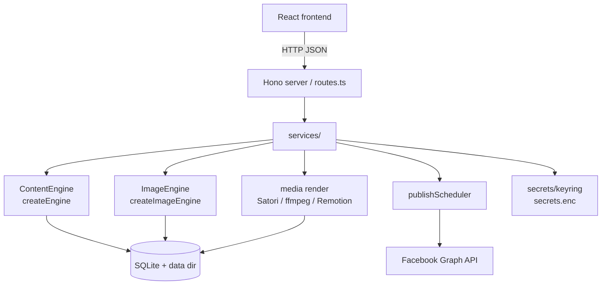

# Architettura

Una mappa ad alto livello di come BookSocial Studio trasforma un libro Markdown in contenuti per i social media programmati e pubblicati. L'app è **local-first**: un singolo processo Node serve l'API e il frontend compilato, con tutto lo stato in un database SQLite embedded e file su disco.

---

## Visione d'insieme

```
                ┌───────────────────────────────────────────────────────┐
                │                React + Vite + Tailwind (web/)           │
                │  Books · Planner · Insights · Connection · Settings     │
                └───────────────────────────┬───────────────────────────┘
                                             │ HTTP (JSON)
                ┌───────────────────────────▼───────────────────────────┐
                │              Hono server (server/src)                  │
                │  routes.ts → services/ → engines, db, scheduler        │
                └──┬───────────────┬───────────────┬──────────────┬─────┘
                   │               │               │              │
        ┌──────────▼───┐  ┌────────▼────────┐ ┌────▼──────┐ ┌─────▼──────────┐
        │ Content      │  │ Image engine    │ │ Media /   │ │ Scheduler /    │
        │ engine       │  │ (pluggable)     │ │ render    │ │ publisher      │
        │ (pluggable)  │  │ createImage     │ │ Satori,   │ │ publish        │
        │ createEngine │  │ Engine()        │ │ resvg,    │ │ Scheduler.ts   │
        └──────┬───────┘  └────────┬────────┘ │ ffmpeg,   │ └───────┬────────┘
               │                   │          │ Remotion  │         │
               │                   │          └─────┬─────┘         │
        ┌──────▼───────────────────▼────────────────▼───────────────▼──────┐
        │   SQLite (better-sqlite3) · data dir: media/ music/ books/        │
        │   db/migrate · db/repositories · secrets/keyring → secrets.enc    │
        └───────────────────────────────────────────────────────────────────┘
                                             │
                                             ▼
                                  Facebook Graph API (facebook/client.ts)
```

---

## Moduli backend (`server/src`)

| Modulo | Responsabilità |
|---|---|
| `routes.ts` | Superficie HTTP API (Hono); delega ai service. |
| `content/` | **Motore di testo.** `analyzer`, `characterAppearance`, `chapterScene`, `postGenerator`, `translate`, ecc. Il `ContentEngine` pluggable si trova in `content/engine.ts`; le implementazioni HTTP in `content/engineApi.ts`. |
| `media/` | **Motore di immagini** (`imageEngine.ts`, `imageGen.ts`) e **rendering**: card testuali via Satori/resvg (`renderCard.ts`), Reel/storie video via ffmpeg e Remotion (`renderVideo.ts`, `renderRemotion.ts`, `renderQueue.ts`). |
| `services/` | Orchestrazione: `visualBible`, `weekPlanner`, `contentService`, `publisher`, `pageConnectService`. |
| `scheduler/` | `publishScheduler.ts` — loop in background che pubblica gli elementi in scadenza (Reel/storie) e riprova in caso di errore. |
| `db/` | `migrate.ts` per SQLite, `pool.ts` per la connessione e `repositories.ts` (accesso ai dati). |
| `secrets/` | `keyring.ts` — cifra/decifra i token e le chiavi API in `secrets.enc`. |
| `facebook/` | `client.ts` — chiamate alle Facebook Graph API (lista delle Pagine gestite, pubblicazione, metadati della pagina). |
| `config.ts` / `paths.ts` | Configurazione basata su variabili d'ambiente e risoluzione del layout della directory dei dati. |
| `*Jobs.ts` | Job in background di lunga durata (analisi, visual bible, generazione settimanale, generazione scene/media). |

---

## Flusso principale

```
1. Import book        importer.ts          .md → stored in books/ + DB record
        │
2. Analysis           analyzer.ts          synopsis, genres, tone, characters (spoiler-aware)
        │             (analysisJobs.ts)
        │
3. Visual bible       services/visualBible  canonical character appearance, per-context outfits,
        │             characterAppearance,   recurring props, minor characters, per-chapter scene cards
        │             characterOutfits, …    → consistent imagery
        │
4. Week generation    services/weekPlanner   a weekly plan: posts / reels / stories with quotes,
        │             weekGenJobs.ts          hashtags, sale links (postGenerator.ts)
        │
5. Scene images       services/sceneImage     ImageEngine generates scene images (or upload-only);
        │             sceneGenJobs.ts          imagePrompt.ts builds styled prompts; visionCheck.ts QC
        │
6. Render             media/renderCard,       text cards (Satori/resvg) + reel/story videos
        │             renderVideo, renderQueue  (ffmpeg / Remotion: Ken-Burns, music, text fades)
        │
7. Publish / schedule services/publisher,     Facebook native scheduling for posts; internal
                      scheduler/publishScheduler  scheduler for reels/stories, with retries
```

I token e le chiavi API utilizzati lungo il percorso vengono letti tramite `secrets/keyring.ts` (cifrati at-rest in `secrets.enc`), mai salvati in chiaro.

---

## Punti di estensione

Il sistema è progettato in modo che l'aggiunta di un provider AI **non** modifichi i chiamanti. Esistono esattamente due engine pluggable, ciascuno costituito da un'interfaccia e da uno `switch` factory centrale:

### Testo — `ContentEngine`

- Interfaccia e factory in `server/src/content/engine.ts`:
  - `interface ContentEngine { name(): string; run(prompt: string): Promise<string>; }`
  - `function createEngine(): ContentEngine` — instrada in base a `CONTENT_PROVIDER`.
- Implementazioni HTTP (compatibili con OpenAI, Google Gemini, Anthropic) in `content/engineApi.ts`; i fallimenti lanciano `ContentError`.

### Immagini — `ImageEngine`

- Interfaccia e factory in `server/src/media/imageEngine.ts`:
  - `interface ImageEngine { name(): string; available(): boolean; generate(input): Promise<string | null>; }`
  - `function createImageEngine(): ImageEngine` — instrada in base a `IMAGE_PROVIDER`.
- Implementazioni: `OpenAIImageEngine`, `GoogleImagenImageEngine`, `LocalSdCliImageEngine`. In caso di fallimento o indisponibilità restituiscono `null`, e l'app ripiega sulla modalità di solo upload.

Per aggiungere un provider: implementa l'interfaccia, aggiungi un `case` nella factory corrispondente, aggiungi le eventuali configurazioni in `server/src/config.ts` e documenta le variabili d'ambiente in `server/.env.example`. Guida completa: [`docs/PROVIDERS.md`](PROVIDERS.md) → "Aggiungere un nuovo provider nel codice".

---

## Vista Mermaid (opzionale)



Vedi anche [`docs/SETUP.md`](SETUP.md) e [`CONTRIBUTING.md`](../CONTRIBUTING.md).
