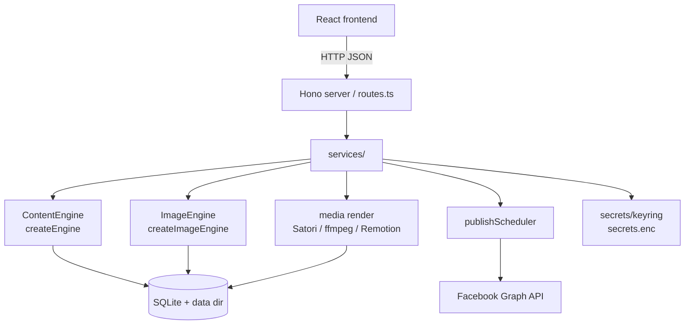

# Architecture

A high-level map of how BookSocial Studio turns a Markdown book into scheduled, published
social-media content. The app is **local-first**: a single Node process serves the API and the built
frontend, with all state in an embedded SQLite database and files on disk.

---

## Big picture

```
                ┌───────────────────────────────────────────────────────┐
                │                React + Vite + Tailwind (web/)           │
                │  Books · Planner · Insights · Connection · Settings     │
                └───────────────────────────┬───────────────────────────┘
                                             │ HTTP (JSON)
                ┌───────────────────────────▼───────────────────────────┐
                │              Hono server (server/src)                  │
                │  routes.ts → services/ → engines, db, scheduler        │
                └──┬───────────────┬───────────────┬──────────────┬─────┘
                   │               │               │              │
        ┌──────────▼───┐  ┌────────▼────────┐ ┌────▼──────┐ ┌─────▼──────────┐
        │ Content      │  │ Image engine    │ │ Media /   │ │ Scheduler /    │
        │ engine       │  │ (pluggable)     │ │ render    │ │ publisher      │
        │ (pluggable)  │  │ createImage     │ │ Satori,   │ │ publish        │
        │ createEngine │  │ Engine()        │ │ resvg,    │ │ Scheduler.ts   │
        └──────┬───────┘  └────────┬────────┘ │ ffmpeg,   │ └───────┬────────┘
               │                   │          │ Remotion  │         │
               │                   │          └─────┬─────┘         │
        ┌──────▼───────────────────▼────────────────▼───────────────▼──────┐
        │   SQLite (better-sqlite3) · data dir: media/ music/ books/        │
        │   db/migrate · db/repositories · secrets/keyring → secrets.enc    │
        └───────────────────────────────────────────────────────────────────┘
                                             │
                                             ▼
                                  Facebook Graph API (facebook/client.ts)
```

---

## Backend modules (`server/src`)

| Module | Responsibility |
|---|---|
| `routes.ts` | HTTP API surface (Hono); delegates to services. |
| `content/` | **Text engine.** `analyzer`, `characterAppearance`, `chapterScene`, `postGenerator`, `translate`, etc. The pluggable `ContentEngine` lives in `content/engine.ts`; HTTP implementations in `content/engineApi.ts`. |
| `media/` | **Image engine** (`imageEngine.ts`, `imageGen.ts`) and **rendering**: text cards via Satori/resvg (`renderCard.ts`), video reels/stories via ffmpeg and Remotion (`renderVideo.ts`, `renderRemotion.ts`, `renderQueue.ts`). |
| `services/` | Orchestration: `visualBible`, `weekPlanner`, `contentService`, `publisher`, `pageConnectService`. |
| `scheduler/` | `publishScheduler.ts` — background loop that publishes due items (reels/stories) and retries failures. |
| `db/` | SQLite `migrate.ts`, connection `pool.ts`, and `repositories.ts` (data access). |
| `secrets/` | `keyring.ts` — encrypts/decrypts tokens and API keys to `secrets.enc`. |
| `facebook/` | `client.ts` — Facebook Graph API calls (list managed Pages, publish, page metadata). |
| `config.ts` / `paths.ts` | Env-driven config and resolution of the data directory layout. |
| `*Jobs.ts` | Long-running background jobs (analysis, visual bible, week generation, scene/media generation). |

---

## The main flow

```
1. Import book        importer.ts          .md → stored in books/ + DB record
        │
2. Analysis           analyzer.ts          synopsis, genres, tone, characters (spoiler-aware)
        │             (analysisJobs.ts)
        │
3. Visual bible       services/visualBible  canonical character appearance, per-context outfits,
        │             characterAppearance,   recurring props, minor characters, per-chapter scene cards
        │             characterOutfits, …    → consistent imagery
        │
4. Week generation    services/weekPlanner   a weekly plan: posts / reels / stories with quotes,
        │             weekGenJobs.ts          hashtags, sale links (postGenerator.ts)
        │
5. Scene images       services/sceneImage     ImageEngine generates scene images (or upload-only);
        │             sceneGenJobs.ts          imagePrompt.ts builds styled prompts; visionCheck.ts QC
        │
6. Render             media/renderCard,       text cards (Satori/resvg) + reel/story videos
        │             renderVideo, renderQueue  (ffmpeg / Remotion: Ken-Burns, music, text fades)
        │
7. Publish / schedule services/publisher,     Facebook native scheduling for posts; internal
                      scheduler/publishScheduler  scheduler for reels/stories, with retries
```

Tokens and API keys used along the way are read through `secrets/keyring.ts` (encrypted at rest in
`secrets.enc`), never stored in plain text.

---

## Extension points

The system is designed so that adding an AI provider does **not** touch callers. There are exactly two
pluggable engines, each an interface plus a central factory `switch`:

### Text — `ContentEngine`

- Interface and factory in `server/src/content/engine.ts`:
  - `interface ContentEngine { name(): string; run(prompt: string): Promise<string>; }`
  - `function createEngine(): ContentEngine` — routes on `CONTENT_PROVIDER`.
- HTTP implementations (OpenAI-compatible, Google Gemini, Anthropic) in `content/engineApi.ts`;
  failures throw `ContentError`.

### Images — `ImageEngine`

- Interface and factory in `server/src/media/imageEngine.ts`:
  - `interface ImageEngine { name(): string; available(): boolean; generate(input): Promise<string | null>; }`
  - `function createImageEngine(): ImageEngine` — routes on `IMAGE_PROVIDER`.
- Implementations: `OpenAIImageEngine`, `GoogleImagenImageEngine`, `LocalSdCliImageEngine`. On
  failure or when unavailable they return `null`, and the app falls back to upload-only mode.

To add a provider: implement the interface, add a `case` in the matching factory, add any config to
`server/src/config.ts`, and document env vars in `server/.env.example`. Full walkthrough:
[`docs/PROVIDERS.md`](PROVIDERS.md) → "Add a new provider in code".

---

## Mermaid view (optional)



See also [`docs/SETUP.md`](SETUP.md) and [`CONTRIBUTING.md`](../CONTRIBUTING.md).
